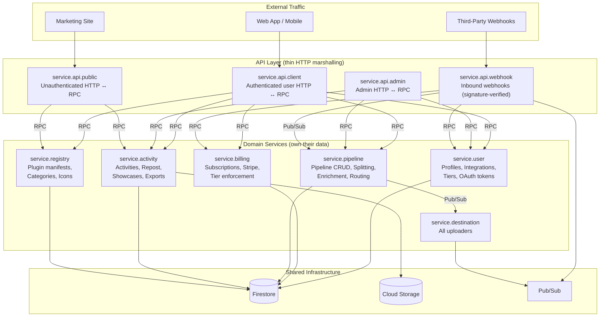
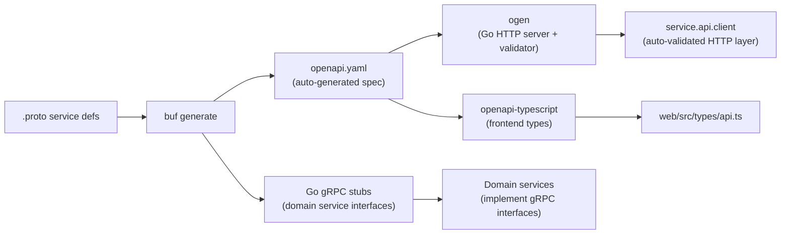

# FitGlue Architecture Overhaul: Research & Proposal

## Executive Summary

FitGlue has reached an inflection point. What started as a lean Cloud Functions architecture has snowballed into **48 individually deployed Cloud Functions** (35 TypeScript, 13 Go) connected by **14 Pub/Sub topics**, managed by **2,569 lines of Terraform**, and governed by **73+ bespoke architectural rules** attempting to paper over the fundamental tension of a polyglot, per-function deployment model.

This proposal outlines a complete backend migration to **domain-owning Go services** communicating via **Protobuf-defined RPC contracts**, with a thin **API layer** for HTTP marshalling, **struct-based IoC dependency injection**, and **auto-generated OpenAPI specifications** for frontend type safety.

---

## 1. The Current State: An Honest Audit

### 1.1 The Function Sprawl

| Category | Count | Runtime | Examples |
|---|---|---|---|
| **Webhook/Source Handlers** | 8 | TypeScript | `hevy-handler`, `strava-handler`, `fitbit-handler`, `polar-handler`, `wahoo-handler`, `oura-handler`, `github-handler`, `mobile-source-handler` |
| **OAuth Handlers** | 8 | TypeScript | `strava-oauth-handler`, `fitbit-oauth-handler`, `spotify-oauth-handler`, `polar-oauth-handler`, `wahoo-oauth-handler`, `oura-oauth-handler`, `google-oauth-handler`, `github-oauth-handler` |
| **User/API Handlers** | 10 | TypeScript | `user-profile-handler`, `user-pipelines-handler`, `user-integrations-handler`, `user-data-handler`, `activities-handler`, `inputs-handler`, `repost-handler`, `registry-handler`, `showcase-handler`, `showcase-management-handler` |
| **Admin/Platform Handlers** | 5 | TypeScript | `admin-handler`, `billing-handler`, `connection-actions-handler`, `data-export-handler`, `auth-email-handler` |
| **Internal Handlers** | 4 | TypeScript | `auth-hooks`, `registration-summary-handler`, `mock-source-handler`, `mobile-sync-handler` |
| **Pipeline Core** | 3 | Go | `enricher`, `enricher-lag`, `pipeline-splitter` |
| **Router/Parser** | 2 | Go | `router`, `fit-parser-handler` |
| **Destination Uploaders** | 8 | Go | `strava-uploader`, `hevy-uploader`, `showcase-uploader`, `trainingpeaks-uploader`, `intervals-uploader`, `googlesheets-uploader`, `github-uploader`, `mock-uploader` |

**Total: ~48 individually deployed Cloud Functions**, each with its own Terraform resource, IAM binding, ZIP package, and cold start penalty.

### 1.2 The Polyglot Tax

The TypeScript/Go split was originally pragmatic — TypeScript for HTTP edge handlers, Go for pipeline internals. In practice:

- **Dual Protobuf generation** — Every `.proto` change triggers `protoc` for both Go and TypeScript, requiring manual `make generate` synchronization
- **Manual Firestore converters** — Go's `FirestoreToUser` / `UserToFirestore` converters are hand-maintained parallel implementations of the TypeScript layer (Rule G21 parity hazard)
- **CloudEvent bridge complexity** — Exists solely to bridge TypeScript producers and Go consumers, including "Pull and Purge" for `camelCase`/`snake_case` collisions
- **Duplicated domain knowledge** — Tier logic, activity type mappings, error patterns all have separate implementations per language
- **Two build systems** — `npm` workspaces + `go build`, with Python gluing ZIP preparation

### 1.3 The Repeated Patterns Problem

Despite `@fitglue/shared`, enormous boilerplate is replicated:

| Pattern | Instances | Description |
|---|---|---|
| SafeHandler wrappers | 35 | Every TS handler uses identical auth/error/logging setup |
| OAuth callback flow | 8 | Each repeats: state validation → code exchange → token storage → redirect |
| Webhook processor | 8 | Each repeats: signature verify → user resolve → config lookup → dedup → fetch → map → publish |
| Destination uploader lifecycle | 8 | Each repeats: pipeline run create → OAuth refresh → API call → status update |
| `sync.Once` bootstrap | 13 | Every Go function repeats the `initService` singleton pattern |
| Lazy-load exports | 35 | [index.js](file:///home/ripixel/dev/fitglue/server/src/typescript/index.js) has 35 identical `require()` patterns |
| Terraform function defs | 48 | ~50 lines of nearly identical Terraform per function |

### 1.4 Infrastructure Cost

- **Cold starts**: 48 individual functions mean 48 cold start surfaces. First sync hitters 3-5 sequential cold starts
- **Deployment time**: `make prepare` builds 48 ZIPs. Terraform diffs 48 `filemd5()` hashes
- **Observability fragmentation**: Tracing one activity across 5+ functions requires correlating logs via `pipelineExecutionId`
- **Module pruning**: Exists entirely because per-function ZIPs need small sizes — a problem services don't have

### 1.5 Messy Protos

The existing 10 `.proto` files have grown organically. `user.proto` alone is **22,973 bytes** — mixing user profiles, pipeline configuration, pending inputs, pipeline runs, and billing state into one file. The proto definitions need a clean-up pass alongside this migration: splitting by domain, consistent naming conventions, and proper package organisation.

---

## 2. The Proposed Architecture

### 2.1 Core Principle: Domain Service Ownership

> [!IMPORTANT]
> The key insight from review: **services own their data**. The API layer never touches Firestore directly. Domain services expose RPC endpoints, and the API layer is a thin marshalling layer that calls them.

This eliminates the current problem where the same data is accessed via different models depending on whether you're in a TypeScript handler or a Go function, and ensures a single authoritative read/write path per domain.

### 2.2 Service Topology



### 2.3 Service Responsibilities

| Service | Owns | Data Store | Trigger | Current Functions Absorbed |
|---|---|---|---|---|
| **service.api.client** | No data — authenticated user HTTP ↔ RPC | None | HTTP | Replaces all user-facing `*-handler` HTTP routing + 8 OAuth handlers consolidated into generic flow |
| **service.api.admin** | No data — admin HTTP ↔ RPC | None | HTTP | `admin-handler`, privileged endpoints that call domain services with admin context |
| **service.api.public** | No data — unauthenticated HTTP ↔ RPC | None | HTTP | Public registry listings, public showcase pages |
| **service.api.webhook** | All inbound webhooks: `/webhook/source/{provider}` for activity sources, `/webhook/billing` for Stripe | Transient (publishes to Pub/Sub, RPC to billing/user) | HTTP (webhooks) | `hevy-handler`, `strava-handler`, `fitbit-handler`, `polar-handler`, `wahoo-handler`, `oura-handler`, `github-handler`, `mobile-source-handler`, `mobile-sync-handler`, `mock-source-handler`, `parkrun-fetcher`, `billing-handler` (webhook portion) |
| **service.user** | User profiles, integration credentials, OAuth tokens, tiers, counters, notification preferences | Firestore `users` collection + subcollections | RPC | `user-profile-handler`, `user-integrations-handler`, `user-data-handler`, `connection-actions-handler`, `auth-hooks`, `auth-email-handler`, `registration-summary-handler`, all OAuth handlers (token storage) |
| **service.billing** | Subscription lifecycle, tier enforcement, trial management | Firestore billing subcollections, Stripe API | RPC | `billing-handler` |
| **service.pipeline** | Pipeline configuration, pipeline runs, pending inputs, enrichment orchestration, routing | Firestore `users/*/pipelines`, executions, pending inputs | RPC + Pub/Sub | `user-pipelines-handler`, `pipeline-splitter`, `enricher`, `enricher-lag`, `router`, `inputs-handler`, `repost-handler` |
| **service.activity** | Activity records, showcase pages, data exports, FIT file parsing | Firestore activities, GCS blobs | RPC + Pub/Sub | `activities-handler`, `showcase-handler`, `showcase-management-handler`, `data-export-handler`, `fit-parser-handler` |
| **service.registry** | Plugin manifests, categories, icons — single source of truth | Firestore/static config | RPC only | `registry-handler` |
| **service.destination** | Destination upload execution | Transient (reads from Pub/Sub) | Pub/Sub | `strava-uploader`, `hevy-uploader`, `showcase-uploader`, `trainingpeaks-uploader`, `intervals-uploader`, `googlesheets-uploader`, `github-uploader`, `mock-uploader` |

> [!NOTE]
> **Four API layers** with distinct auth policies: `service.api.client` (Firebase Auth JWT), `service.api.admin` (admin-only auth), `service.api.public` (no auth, rate-limited), `service.api.webhook` (provider signature verification). All four are thin HTTP marshallers — no domain logic, no data access. Domain services only receive RPC calls, never direct HTTP.

### 2.4 How a Request Flows

**Example: User views their profile**

```
1. Web → GET /api/users/me → service.api.client
2. service.api.client validates JWT, extracts userID
3. service.api.client calls service.user.GetProfile(userID) via RPC
4. service.user reads Firestore, returns UserProfile proto
5. service.api.client marshals proto → JSON, applies OpenAPI response validation
6. service.api.client → 200 JSON → Web
```

**Example: Strava webhook fires**

```
1. Strava → POST /webhook/source/strava → service.api.webhook
2. service.api.webhook verifies signature, resolves user
3. service.api.webhook calls service.user.GetIntegration(userID, "strava") via RPC
4. service.api.webhook fetches activity from Strava API using tokens
5. service.api.webhook normalises → StandardizedActivity proto
6. service.api.webhook publishes to topic-raw-activity via Pub/Sub
7. service.pipeline picks up, splits per user pipeline, enriches, routes
8. service.destination picks up, uploads to configured destinations
```

**Example: User creates a pipeline**

```
1. Web → POST /api/users/me/pipelines → service.api.client
2. service.api.client validates JWT + OpenAPI request shape
3. service.api.client calls service.pipeline.CreatePipeline(userID, config) via RPC
4. service.pipeline validates config, writes to Firestore, returns PipelineConfig proto
5. service.api.client marshals → 201 JSON → Web
```

### 2.5 RPC Mechanism: Internal gRPC or HTTP?

Two options for domain service ↔ API layer communication:

| Option | Pros | Cons |
|---|---|---|
| **gRPC (recommended)** | Native protobuf wire format, codegen'd clients, streaming support, strong typing | Slightly more infrastructure (gRPC ports) |
| **Internal HTTP + protojson** | Simpler deployment, same ports | Manual client code, no compile-time route checking |

**Recommendation:** Use **gRPC for inter-service RPC**. Since the `.proto` files already define the service contracts, `protoc-gen-go-grpc` generates both server and client stubs for free. The API layer gets a type-safe client to call domain services without any manual HTTP wiring.

```go
// Auto-generated gRPC client in service.api.client
conn, _ := grpc.Dial("service-user:8081", grpc.WithInsecure())
userClient := pb.NewUserServiceClient(conn)

// Type-safe call — compiler enforces request/response shapes
profile, err := userClient.GetProfile(ctx, &pb.GetProfileRequest{UserId: uid})
```

For Cloud Run, services can communicate via [Cloud Run service-to-service auth](https://cloud.google.com/run/docs/authenticating/service-to-service) with automatic OIDC token injection.

### 2.6 Provider Plugin Architecture (Preventing the Monolith)

> [!CAUTION]
> Without careful design, consolidating 8 webhook handlers into `service.api.webhook` and 8 uploaders into `service.destination` creates a monolith where Strava-specific logic bleeds into Fitbit-specific logic. The existing enricher `Provider` interface already solves this pattern well — we extend it to all provider-specific code.

#### 2.6.1 The Pattern: Interface + Registry + Isolated Packages

The enricher already has this right: a `Provider` interface, a `Registry` with `Register()`/`GetByType()`, and each provider in its own package (e.g., `providers/heart_rate_summary/`, `providers/weather/`). We apply the same pattern to ingress and destinations:

```
internal/
├── ingress/
│   ├── handler.go              # HTTP router: /webhooks/{provider}
│   ├── processor.go            # Generic WebhookProcessor orchestrator
│   ├── registry.go             # SourceRegistry: Register() / GetBySource()
│   └── sources/                # One package per source provider
│       ├── interfaces.go       # SourceProvider interface
│       ├── strava/
│       │   ├── provider.go     # Implements SourceProvider
│       │   ├── mapper.go       # Strava API response → StandardizedActivity
│       │   └── provider_test.go
│       ├── fitbit/
│       │   ├── provider.go
│       │   ├── mapper.go
│       │   └── provider_test.go
│       ├── hevy/
│       │   └── ...
│       ├── polar/
│       │   └── ...
│       └── mobile/
│           └── ...
├── destination/
│   ├── handler.go              # Pub/Sub listener
│   ├── executor.go             # Generic upload orchestrator
│   ├── registry.go             # DestinationRegistry
│   └── uploaders/              # One package per destination
│       ├── interfaces.go       # DestinationUploader interface
│       ├── strava/
│       │   └── uploader.go     # Implements DestinationUploader
│       ├── hevy/
│       │   └── uploader.go
│       └── ...
```

#### 2.6.2 Source Provider Interface

```go
// internal/ingress/sources/interfaces.go
type SourceProvider interface {
    // Source returns the provider identifier (e.g., "strava", "fitbit")
    Source() string

    // VerifyWebhook validates the incoming webhook signature/authenticity
    VerifyWebhook(r *http.Request) error

    // ResolveUser extracts the user identifier from the webhook payload
    // and maps it to a FitGlue user ID
    ResolveUser(ctx context.Context, body []byte) (userID string, err error)

    // FetchActivity retrieves the full activity data from the source API
    // using the user's stored credentials
    FetchActivity(ctx context.Context, externalID string, creds *pb.OAuthTokens) (*pb.StandardizedActivity, error)

    // WebhookRoutes returns any provider-specific routes
    // (e.g., Strava needs GET for subscription verification, Fitbit needs POST for subscriber verify)
    WebhookRoutes() []Route
}
```

#### 2.6.3 Destination Uploader Interface

```go
// internal/destination/uploaders/interfaces.go
type DestinationUploader interface {
    // Destination returns the destination identifier
    Destination() string

    // Upload sends the enriched activity to the external service
    Upload(ctx context.Context, activity *pb.StandardizedActivity, creds *pb.OAuthTokens, config map[string]string) (*UploadResult, error)

    // SupportsUpdate returns true if the destination supports updating existing activities
    SupportsUpdate() bool

    // Update modifies an existing activity at the destination
    Update(ctx context.Context, externalID string, activity *pb.StandardizedActivity, creds *pb.OAuthTokens) error
}
```

#### 2.6.4 The Generic Orchestrator

The orchestrator handles all the shared lifecycle — the provider only implements the provider-specific bits:

```go
// internal/ingress/processor.go
type WebhookProcessor struct {
    registry    SourceRegistry
    userService pb.UserServiceClient   // RPC call, not direct DB access
    publisher   Publisher
    logger      *slog.Logger
}

func (p *WebhookProcessor) Handle(w http.ResponseWriter, r *http.Request) {
    providerName := chi.URLParam(r, "provider")
    source, ok := p.registry.Get(providerName)
    if !ok { ... }

    // 1. Provider-specific: verify signature
    if err := source.VerifyWebhook(r); err != nil { ... }

    // 2. Provider-specific: resolve user
    userID, err := source.ResolveUser(r.Context(), body)

    // 3. Shared: get credentials via RPC (provider never touches DB)
    creds, err := p.userService.GetIntegration(ctx, &pb.GetIntegrationRequest{
        UserId:   userID, 
        Provider: providerName,
    })

    // 4. Shared: check pipeline exists, dedup
    ...

    // 5. Provider-specific: fetch & map activity
    activity, err := source.FetchActivity(ctx, externalID, creds.Tokens)

    // 6. Shared: publish to pipeline
    p.publisher.Publish(ctx, "topic-raw-activity", activity)
}
```

#### 2.6.5 Why This Prevents Monolith

| Guardrail | Mechanism |
|---|---|
| **No cross-provider imports** | Each provider is its own Go package — `strava/` cannot import `fitbit/` |
| **Providers never touch the DB** | Credentials come via RPC from `service.user`, not direct Firestore reads |
| **Shared lifecycle is in the orchestrator** | Dedup, pipeline check, publishing are in `processor.go`, not in each provider |
| **Adding a new source/destination** | Create a new package, implement the interface, register in `init()` — no other files touched |
| **Provider-specific logic is testable in isolation** | Each provider package has its own `_test.go` with mocked interfaces |
| **Clear boundary per provider** | Each provider directory contains: `provider.go` (entry point), `mapper.go` (API response → proto), `_test.go` |

This mirrors exactly how the enrichers work today — 40 enricher providers in separate packages, all conforming to `providers.Provider`, registered via `providers.Register()`, and orchestrated by the merger. The webhook and destination services simply adopt the same proven pattern.

---

## 3. All-Go Migration

Every service is pure Go. The TypeScript server runtime is eliminated entirely.

### 3.1 What's Gained

| Dimension | Current (TypeScript) | Proposed (Go) |
|---|---|---|
| **Type safety** | Runtime type assertions, `unknown` → cast patterns | Compile-time type checking, zero runtime assertion |
| **Protobuf integration** | `ts-proto` generated types, manual JSON parity | Native `protojson`/`proto`, direct marshal/unmarshal |
| **Error handling** | `try/catch` with `HttpError` throws | Explicit `error` returns, no hidden control flow |
| **Cold start** | ~800ms-2s per function | ~50-100ms per service |
| **Concurrency** | Single-threaded event loop | Goroutines, true parallelism |
| **Build** | `npm install`, `tsc`, workspace linking, module pruning | `go build`, single binary, no pruning |
| **Dependencies** | `package.json` across ~35 workspaces | Single `go.mod` |
| **Testing** | Jest + complex mock patterns | `go test`, table-driven, interface mocking |

### 3.2 What's Lost (and How to Mitigate)

| Loss | Mitigation |
|---|---|
| Rapid prototyping speed | Template-based scaffolding for handlers |
| Express middleware ecosystem | `chi` router has excellent middleware support |
| Frontend dev familiarity with backend | OpenAPI contracts mean frontend never touches Go |
| Existing TypeScript test suites | Phased migration; Go's table-driven tests are simpler |
| `@fitglue/shared` library | Becomes `pkg/` packages — already partially exists |

---

## 4. Struct-Based IoC Dependency Injection

Replace `sync.Once` singletons with explicit, compile-time DI via struct composition.

> [!TIP]
> **Why not Wire/Dig?** For FitGlue's scale (~6 services, ~20 interfaces), explicit struct wiring in `main.go` is more readable and debuggable. If it compiles, it's wired correctly.

### 4.1 Domain Service Example

```go
// service.user — owns all user data
type UserService struct {
    db       UserStore       // Firestore adapter for users collection
    billing  BillingClient   // Stripe client
    logger   *slog.Logger
}

func NewUserService(db UserStore, billing BillingClient, logger *slog.Logger) *UserService {
    return &UserService{db: db, billing: billing, logger: logger}
}

// Implements the gRPC UserServiceServer interface
func (s *UserService) GetProfile(ctx context.Context, req *pb.GetProfileRequest) (*pb.GetProfileResponse, error) {
    user, err := s.db.Get(ctx, req.UserId)
    if err != nil {
        return nil, status.Errorf(codes.NotFound, "user not found")
    }
    return &pb.GetProfileResponse{User: user}, nil
}
```

### 4.2 API Layer Example

```go
// service.api.client — thin marshalling, no data access
type ClientAPI struct {
    users    pb.UserServiceClient     // gRPC client to service.user
    pipeline pb.PipelineServiceClient  // gRPC client to service.pipeline
    activity pb.ActivityServiceClient  // gRPC client to service.activity
}

func (a *ClientAPI) HandleGetProfile(w http.ResponseWriter, r *http.Request) {
    uid := auth.UserID(r.Context())
    resp, err := a.users.GetProfile(r.Context(), &pb.GetProfileRequest{UserId: uid})
    if err != nil {
        writeGRPCError(w, err)
        return
    }
    writeJSON(w, http.StatusOK, resp) // OpenAPI middleware validates shape
}
```

### 4.3 Composition Root

```go
// cmd/api-client/main.go
func main() {
    // Connect to domain services via gRPC
    userConn := grpc.Dial("service-user:8081")
    pipelineConn := grpc.Dial("service-pipeline:8082")
    activityConn := grpc.Dial("service-activity:8083")

    api := &ClientAPI{
        users:    pb.NewUserServiceClient(userConn),
        pipeline: pb.NewPipelineServiceClient(pipelineConn),
        activity: pb.NewActivityServiceClient(activityConn),
    }

    r := chi.NewRouter()
    r.Use(middleware.Auth(firebaseAuth))
    r.Get("/api/users/me", api.HandleGetProfile)
    // ...
    http.ListenAndServe(":8080", r)
}
```

---

## 5. Protobuf Contracts & Proto Cleanup

### 5.1 Current Proto State (Messy)

The 10 existing `.proto` files have grown organically — `user.proto` is nearly 23KB mixing user profiles, pipeline config, pending inputs, and billing into one file. No service definitions exist.

### 5.2 Proposed Proto Reorganisation

```
proto/
├── models/
│   ├── user/
│   │   ├── profile.proto          # UserProfile, Tier, NotificationPrefs
│   │   ├── integration.proto      # OAuthTokens, IntegrationConfig
│   │   └── billing.proto          # SubscriptionState, TrialInfo
│   ├── pipeline/
│   │   ├── config.proto           # PipelineConfig, EnricherConfig
│   │   ├── execution.proto        # PipelineRun, ExecutionRecord
│   │   └── pending_input.proto    # PendingInput
│   ├── activity/
│   │   ├── standardized.proto     # StandardizedActivity, Session, Lap, Record
│   │   ├── source.proto           # ActivitySource, ActivityType
│   │   └── uploaded.proto         # UploadedActivity
│   ├── plugin/
│   │   ├── manifest.proto         # PluginManifest
│   │   └── provider.proto         # EnricherProviderType, Destination
│   └── events/
│       └── pipeline.proto         # ActivityPayload, EnrichedActivityEvent
├── services/
│   ├── user.proto                 # service UserService { ... }
│   ├── pipeline.proto             # service PipelineService { ... }
│   ├── activity.proto             # service ActivityService { ... }
│   └── registry.proto             # service RegistryService { ... }
└── buf.yaml                       # buf configuration for linting + breaking change detection
```

### 5.3 Service Definitions

```protobuf
// services/user.proto
syntax = "proto3";
package fitglue.user.v1;

service UserService {
  rpc GetProfile(GetProfileRequest) returns (GetProfileResponse);
  rpc UpdateProfile(UpdateProfileRequest) returns (UpdateProfileResponse);
  rpc GetIntegration(GetIntegrationRequest) returns (GetIntegrationResponse);
  rpc SetIntegration(SetIntegrationRequest) returns (SetIntegrationResponse);
  rpc ListCounters(ListCountersRequest) returns (ListCountersResponse);
  rpc UpdateCounter(UpdateCounterRequest) returns (UpdateCounterResponse);
}
```

```protobuf
// services/pipeline.proto
syntax = "proto3";
package fitglue.pipeline.v1;

service PipelineService {
  rpc ListPipelines(ListPipelinesRequest) returns (ListPipelinesResponse);
  rpc CreatePipeline(CreatePipelineRequest) returns (CreatePipelineResponse);
  rpc UpdatePipeline(UpdatePipelineRequest) returns (UpdatePipelineResponse);
  rpc DeletePipeline(DeletePipelineRequest) returns (DeletePipelineResponse);
  rpc SubmitInput(SubmitInputRequest) returns (SubmitInputResponse);
  rpc RepostActivity(RepostActivityRequest) returns (RepostActivityResponse);
}
```

### 5.4 `buf` for Proto Management

`buf` replaces raw `protoc` invocation and provides:
- **Linting** — enforces naming conventions, package structure
- **Breaking change detection** — CI blocks if you accidentally remove/rename a field
- **Managed plugins** — no local `protoc-gen-*` installation needed
- **Multi-target generation** — Go stubs, gRPC stubs, OpenAPI spec all from one `buf.gen.yaml`

---

## 6. OpenAPI Generation with Auto-Validation

### 6.1 The Generation Pipeline



### 6.2 How Validation Works

The API layer uses `ogen`-generated middleware that **automatically**:
1. Validates request body against JSON Schema from the OpenAPI spec
2. Validates path/query parameters are present and correctly typed
3. Validates response body matches declared schema before sending to client

```go
// ogen generates a server interface — compiler enforces every endpoint is implemented
type Handler interface {
    GetProfile(ctx context.Context) (*UserProfile, error)
    UpdateProfile(ctx context.Context, req *UpdateProfileRequest) (*UserProfile, error)
}
```

### 6.3 Frontend Type Safety

The existing `openapi-typescript` tooling continues, but the source of truth shifts:

| Today | Proposed |
|---|---|
| Manually maintained swagger files | Auto-generated from `.proto` service definitions |
| Describes ~20% of API surface | Describes 100% of API surface (enforced by codegen) |
| Manual sync between Go/TS types and swagger | Single source: `.proto` → everything generated |

---

## 7. Pub/Sub Topic Consolidation

| Current (14 topics) | Proposed (4 topics) |
|---|---|
| `topic-raw-activity` | `topic-raw-activity` (keep) |
| `topic-mobile-activity` | Absorbed into `service.api.webhook` internal routing |
| `topic-pipeline-activity` | `topic-pipeline-activity` (keep) |
| `topic-enriched-activity` | `topic-enriched-activity` (keep) |
| `topic-enrichment-lag` | Becomes retry logic within `service.pipeline` |
| 7× `topic-job-upload-*` | → `topic-destination-upload` (single topic, destination in payload) |
| `topic-parkrun-results-trigger` | Cloud Scheduler → direct HTTP to `service.api.webhook` |
| `topic-registration-summary-trigger` | Cloud Scheduler → direct HTTP to `service.user` |

---

## 8. Migration Plan

### Phase 0: Foundation (Weeks 1-2)
- Proto reorganisation and cleanup (split `user.proto` monolith)
- `buf.gen.yaml` setup with Go, gRPC, and OpenAPI targets
- Project skeleton: `cmd/` per service, `internal/` per domain
- IoC composition root for `service.user` as pilot

### Phase 1: Domain Services + Registry (Weeks 3-6)
- **`service.user`** — profiles, integrations, OAuth tokens, tiers, billing, counters
- **`service.pipeline`** — pipeline CRUD, splitting, enrichment, routing (mostly existing Go code restructured)
- **`service.activity`** — activity CRUD, showcases, exports, FIT parsing
- **`service.registry`** — plugin manifests, categories, icons (RPC only)

### Phase 2: Integration Test Harness (Weeks 7-8)

> [!IMPORTANT]
> With proto-defined RPC contracts and IoC-injected dependencies, we can build a comprehensive test harness **before** wiring up the API layer. This gives us confidence that every domain service behaves correctly in isolation and across service boundaries.

**Strategy:**

- **Unit tests per service** — IoC makes this trivial. Inject mock `UserStore`, `Publisher`, `BlobStore`, etc. into each service's struct and test every RPC handler with table-driven tests
- **Proto-generated test fixtures** — generate mock `GetProfileRequest` / `GetProfileResponse` payloads directly from the proto definitions, ensuring test data matches the contract exactly
- **Cross-service integration tests** — spin up domain services in-process with mock stores, wire real gRPC clients between them, and test full flows (e.g., `service.api.webhook` → `service.user.GetIntegration` → publish to Pub/Sub mock → `service.pipeline` picks up)
- **Pub/Sub interaction tests** — inject a mock `Publisher` that captures messages, assert on topic name + payload shape. Same for `BlobStore` writes
- **OpenAPI contract tests** — once the spec is generated, validate that every RPC response marshals to JSON matching the OpenAPI schema

```go
// Example: integration test for webhook flow
func TestStravaWebhookFlow(t *testing.T) {
    // Mock dependencies via IoC
    mockUserSvc := &MockUserServiceServer{
        GetIntegrationFn: func(ctx context.Context, req *pb.GetIntegrationRequest) (*pb.GetIntegrationResponse, error) {
            return &pb.GetIntegrationResponse{Tokens: testTokens}, nil
        },
    }
    mockPublisher := &MockPublisher{}

    // Wire up ingress with mocks
    processor := ingress.NewWebhookProcessor(mockUserSvc, mockPublisher, testLogger)

    // Simulate Strava webhook
    req := httptest.NewRequest("POST", "/webhooks/strava", stravaPayload)
    rec := httptest.NewRecorder()
    processor.Handle(rec, req)

    // Assert: correct topic, correct payload shape
    assert.Equal(t, "topic-raw-activity", mockPublisher.LastTopic)
    assert.Equal(t, pb.ActivitySource_STRAVA, mockPublisher.LastPayload.Source)
}
```

### Phase 3: API Layers (Weeks 9-11)
- **`service.api.client`** — authenticated user API, thin marshalling via gRPC
- **`service.api.admin`** — admin API surface with elevated auth
- **`service.api.public`** — unauthenticated API for registry/showcase
- **`service.api.webhook`** — webhook processing (generic `WebhookProcessor` with provider config)
- OpenAPI generation pipeline operational, frontend types auto-generated

### Phase 4: Destination Service + Cleanup (Weeks 12-14)
- **`service.destination`** — all uploaders consolidated (mostly existing Go code)
- Remove all TypeScript server code (`server/src/typescript/`)
- CI/CD updated: deploy 10 Cloud Run services, retire Cloud Functions
- Retire module pruning system

---

## 9. Expected Outcomes

| Metric | Current | Projected | Improvement |
|---|---|---|---|
| Deployable units | 48 | 10 | **79% reduction** |
| Terraform function defs | 2,569 lines | ~300 lines | **88% reduction** |
| Cold start (p50) | ~1.2s | ~80ms | **93% faster** |
| Languages on server | 2 (TS + Go) | 1 (Go) | **50% reduction** |
| Direct Firestore access paths | Every handler | Domain services only | **Single data owner per domain** |
| Proto files | 10 (messy) | ~15 (organised by domain) | Clean separation |
| OAuth handler packages | 8 | 1 generic | **87% reduction** |
| Webhook handler packages | 8 | 1 generic + config | **87% reduction** |
| Module pruning scripts | 2 | 0 | **Eliminated** |

---

## 10. Confirmed Decisions

| Decision | Choice | Rationale |
|---|---|---|
| **Inter-service RPC** | gRPC | Type-safe codegen'd clients, protobuf wire format, compile-time route checking |
| **DI framework** | None (explicit struct wiring) | `main.go` composition root — if it compiles, it's wired correctly |
| **Data ownership** | Domain services own their Firestore collections | No direct SDK access from API layer; single authoritative read/write path |
| **Migration strategy** | Big Bang | No non-developer traffic; breaking changes and failure periods acceptable |
| **Cloud Run min-instances** | `min_instances = 1` per service | ~£15/month per service to eliminate cold starts entirely |
| **Admin API** | Separate `service.api.admin` | Own auth, middleware, and security policies separate from user-facing API |
| **Registry** | Own `service.registry` domain service | Single source of truth for both app (via RPC) and marketing site (via public HTTP) |
| **Webhook pattern** | Pluggable `SourceProvider` interface | Provider-specific implementations behind a generic orchestrator; all webhooks follow the same lifecycle |

## 11. Final Service Count: 10

| # | Service | Type | Auth |
|---|---|---|---|
| 1 | `service.api.client` | API Layer | Firebase Auth JWT |
| 2 | `service.api.admin` | API Layer | Admin-only auth |
| 3 | `service.api.public` | API Layer | None (rate-limited) |
| 4 | `service.api.webhook` | API Layer | Provider signature verification |
| 5 | `service.user` | Domain Service | RPC only |
| 6 | `service.billing` | Domain Service | RPC only |
| 7 | `service.pipeline` | Domain Service | RPC only |
| 8 | `service.activity` | Domain Service | RPC only |
| 9 | `service.registry` | Domain Service | RPC only |
| 10 | `service.destination` | Worker Service | Pub/Sub only |
